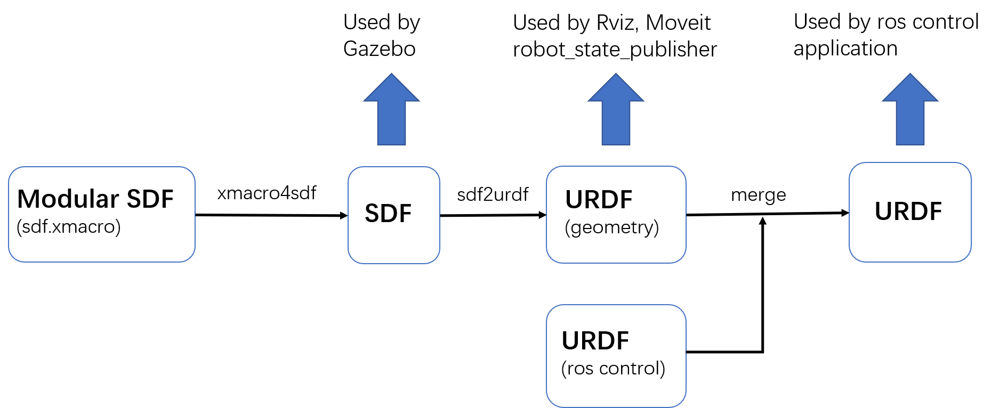

# sdformat tools

`Sdformat` (`SDF`) is used by `Gazebo` simulator to describe simulated robots and simulated environment (sim world). As ROS users, we know `URDF` is more common to describe robot's geometry, kinematic and dynamic properties in ROS community, which is used by many ROS applications like `rviz`, `moveit`, `robot_state_publisher`.

this package provides some easy, convenient and flexible tools to help us make the best use of `SDF` in ROS community:

* `xmacro4sdf`: write modular `SDF` xml by using macro  (not nest model) , refer to [xmacro](https://github.com/gezp/xmacro).
* `sdf2urdf`: convert `SDF` to `URDF` with some limitation.
* `urdf_generator`: urdf utility class (support sdf2urdf, merge).

a workflow of using SDF in ROS community with these tools:




## Usage

Installation

```bash
pip install xmacro
# cd src of ros workspace
git clone https://github.com/gezp/sdformat_tools.git
# cd ros workspace
colcon build
```

xmacro4sdf

```bash
xmacro4sdf model.sdf.xmacro
```

sdf2urdf

```bash
sdf2urdf model.sdf
```

urdf_generator

```python
from sdformat_tools.urdf_generator import UrdfGenerator

urdf_generator = UrdfGenerator()
urdf_generator.parse_from_sdf_file(robot_sdf_path)
urdf_generator.remove_joint('world_joint')
urdf_generator.extend_urdf_file(control_urdf_path)
robot_urdf_xml = urdf_generator.to_string()
```
